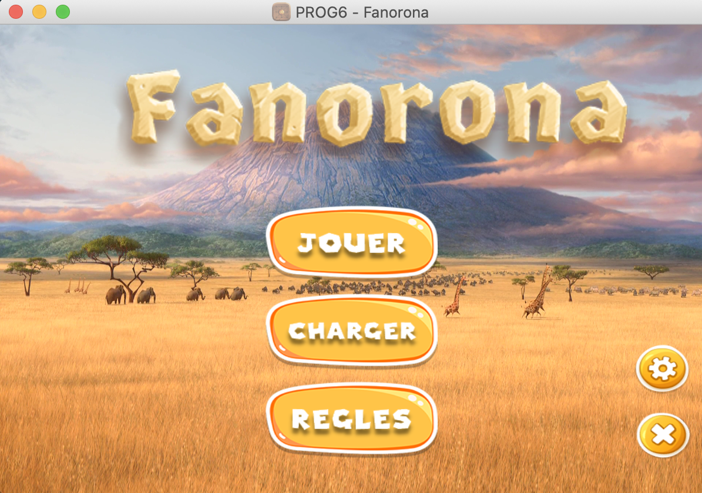

<h1 align=center> GUI Fanorona Game with minmax AI</h1>



## Description
This project is a Java/JavaFX GUI for Fanorona, a Malagasy checkers variant. Scene builder was used to build the GUI as fxml files, injected in the project.   

## Features
- Single or 2 players mode : play against your friend or try to beat 3 levels of IA in single mode (based on minmax and alpha-beta pruning algorithms).
- Save your game.
- Load an existant game.
- Undo as many moves as possible.
- Show move hints.

## Requirements 
-  **Java 8 or higher**
-  **JavaFx 2 or higher**

## How to run   
```sh
$ java -jar Fanoronna.jar
```   